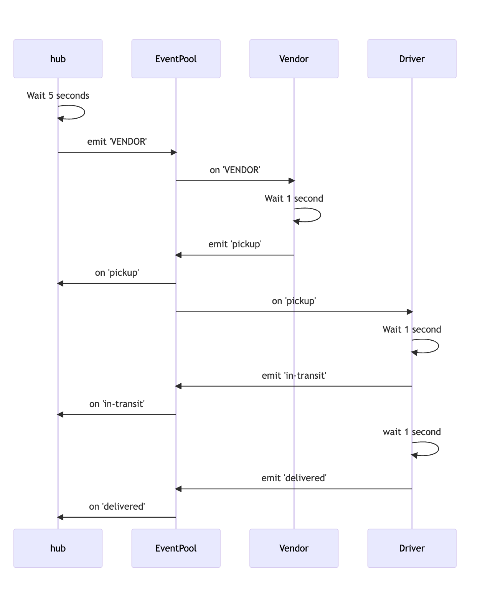

# caps
socket.io
Author : Ashwini Uppal

## overview

The Socket Server will create a namespace of caps that will receive all CAPS event traffic.
Each Vendor and Driver Client will connect to the caps namespace.
The server will emit specific events to each socket that is listening for their designated events from the Global Event Pool defined in the Server.
Each Vendor will only emit and listen for specific events based on their Vendor ID. This will be managed by rooms within Socket.io.
Each Driver will “pick up” a package when the vendor notifies the Server that an “order” is ready and simulate “in-transit” and “delivered” events.

## User stories

The following user/developer stories detail the major functionality for this phase of the project.

As a vendor, I want to alert the system when I have a package to be picked up.
As a driver, I want to be notified when there is a package to be delivered.
As a driver, I want to alert the system when I have picked up a package and it is in transit.
As a driver, I want to alert the system when a package has been delivered.
As a vendor, I want to be notified when my package has been delivered.
And as developers, here are some of the development stories that are relevant to the above.

As a developer, I want to use industry standards for managing the state of each package.
As a developer, I want to create an event driven system so that I can write code that happens in response to events, in real time.

## test

* `npm test vendorHandler.test.js`
* `npm test driverHandler.test.js`

### UML

